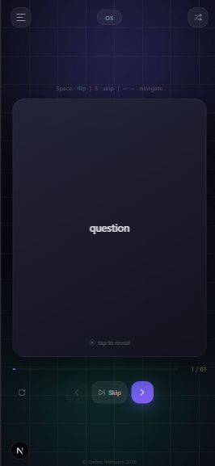
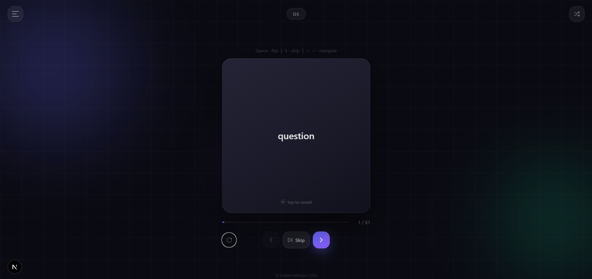
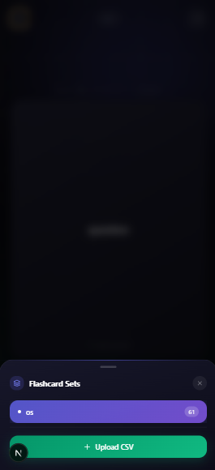

# 🃏 Flashcard App

> An interactive, offline-capable flashcard study app built with **Next.js 14**, **Framer Motion**, and **Tailwind CSS**. Upload any CSV and start learning in seconds — with shuffle mode, skip tracking, and full PWA support.

<div align="center">


</div>

---

## 📸 Screenshots

<!-- ─────────────────────────────────────────────────────────────────
  HOW TO ADD SCREENSHOTS
  ════════════════════════
  1. Take screenshots of your running app (mobile + desktop).
  2. Create a folder:  /screenshots/  in the ROOT of your project.
  3. Save your images there with the exact filenames below.
  4. The table will automatically render on GitHub.

  Recommended sizes:
    • mobile-home.png    →  390 × 844 px  (iPhone 14 screenshot)
    • mobile-skip.png    →  390 × 844 px
    • mobile-shuffle.png →  390 × 844 px
    • desktop-home.png   →  1280 × 800 px (browser screenshot)
    • desktop-dialog.png →  1280 × 800 px

  Quick capture tips:
    • Mac:  Cmd + Shift + 4 (area), Cmd + Shift + 5 (screen/window)
    • iOS:  Side button + Volume Up  → AirDrop to Mac
    • Chrome DevTools → toggle device toolbar → Cmd+Shift+P → "Capture screenshot"
──────────────────────────────────────────────────────────────────── -->

<div align="center">

| Mobile — Study | Mobile — Skipped | Desktop |
|:-:|:-:|:-:|
|  |  |  |

| Shuffle Mode | Menu (Bottom Sheet) |
|:-:|:-:|
|  |  |

</div>

---

## ✨ Features

- **Flip cards** — tap or press `Space` to reveal the answer
- **Shuffle mode** — randomises card order with a single toggle (Fisher-Yates algorithm)
- **Skip & track** — skip cards you want to revisit; an amber badge counts them
- **Skipped review panel** — jump directly to any skipped card from the list
- **CSV upload** — import any two-column CSV (`question, answer`) instantly
- **Animated background** — floating orbs, grid overlay, and grain texture
- **Responsive** — bottom sheet on mobile · centered dialog on desktop
- **PWA / Offline** — install to home screen; service worker caches assets and pages
- **Keyboard shortcuts** — `Space` flip · `← →` navigate · `S` skip

---

## 🗂 Project Structure

```
flash-card/
├── app/
│   ├── layout.tsx          # Root layout, fonts, PWA metadata
│   ├── globals.css         # Tailwind + custom properties + safe-area
│   └── page.tsx            # Renders <FlashcardApp />
│
├── components/
│   └── FlashcardApp.tsx    # Main app component (all logic + UI)
│
├── public/
│   ├── manifest.json       # PWA manifest
│   ├── sw.js               # Service worker (offline caching)
│   ├── offline.html        # Offline fallback page
│   │
│   ├── icons/              # ← ADD YOUR APP ICONS HERE (see Icons section)
│   │   ├── icon-16x16.png
│   │   ├── icon-32x32.png
│   │   ├── icon-96x96.png
│   │   ├── icon-144x144.png
│   │   ├── icon-192x192.png
│   │   ├── icon-512x512.png
│   │   ├── icon-maskable-192.png
│   │   ├── icon-maskable-512.png
│   │   ├── apple-icon-120x120.png
│   │   ├── apple-icon-152x152.png
│   │   └── apple-icon-180x180.png
│   │
│   ├── splash/             # ← iOS launch screens (optional)
│   │   ├── apple-splash-750-1334.png
│   │   ├── apple-splash-1170-2532.png
│   │   ├── apple-splash-1290-2796.png
│   │   └── apple-splash-2048-2732.png
│   │
│   ├── flashcards/         # ← PUT DEFAULT CSV FILES HERE
│   │   └── example.csv
│   │
│   └── screenshots/        # ← Referenced in manifest.json
│       ├── mobile-home.png
│       └── desktop-home.png
│
├── screenshots/            # ← GitHub README screenshots (this folder)
│   ├── mobile-home.png
│   ├── mobile-skip.png
│   ├── mobile-shuffle.png
│   ├── mobile-menu.png
│   └── desktop-home.png
│
└── pages/api/ (or app/api/)
    └── flashcards/
        └── route.ts        # Serves default CSV files from /public/flashcards
```

---

## 🚀 Getting Started

### Prerequisites

- Node.js **18+**
- npm / yarn / pnpm

### Installation

```bash
# 1. Clone the repository
git clone https://github.com/YOUR_USERNAME/flashcard-app.git
cd flashcard-app

# 2. Install dependencies
npm install

# 3. Start the development server
npm run dev
```

Open [http://localhost:3000](http://localhost:3000) in your browser.

### Build for Production

```bash
npm run build
npm start
```

---

## 📄 CSV Format

Your flashcard CSV must have **two columns** — no header row needed:

```csv
What is the capital of France?,Paris
What does HTML stand for?,HyperText Markup Language
Who wrote Hamlet?,William Shakespeare
```

| Column | Content |
|--------|---------|
| A | Question / front of card |
| B | Answer / back of card |

Upload via the **menu → Upload CSV** button, or drop default sets into `/public/flashcards/`.

---

## ⌨️ Keyboard Shortcuts

| Key | Action |
|-----|--------|
| `Space` | Flip card |
| `→` | Next card |
| `←` | Previous card |
| `S` | Skip current card |

---

## 🖼 App Icons Guide

> **Where to add your icons → `/public/icons/`**

You need icons in multiple sizes. The easiest workflow:

### Option A — Generate automatically (recommended)

1. Create or find a **1024 × 1024 px** square logo (PNG, transparent background)
2. Go to **[realfavicongenerator.net](https://realfavicongenerator.net)** or **[favicon.io](https://favicon.io)**
3. Upload your logo → download the generated package
4. Copy the PNG files into `/public/icons/` and rename them to match the list below

### Option B — Use sharp / ImageMagick locally

```bash
# Install sharp CLI
npm install -g sharp-cli

# Generate all sizes from your master icon
sharp -i public/icons/icon-master.png -o public/icons/icon-16x16.png   resize 16 16
sharp -i public/icons/icon-master.png -o public/icons/icon-32x32.png   resize 32 32
sharp -i public/icons/icon-master.png -o public/icons/icon-96x96.png   resize 96 96
sharp -i public/icons/icon-master.png -o public/icons/icon-192x192.png resize 192 192
sharp -i public/icons/icon-master.png -o public/icons/icon-512x512.png resize 512 512
```

### Required icon files

```
public/icons/
├── icon-16x16.png          Browser favicon tab
├── icon-32x32.png          Browser favicon HiDPI
├── icon-96x96.png          Chrome Web Store / shortcuts
├── icon-144x144.png        Windows tile
├── icon-192x192.png        Android home screen
├── icon-512x512.png        Android splash / PWA install prompt
├── icon-maskable-192.png   Android adaptive icon (192px, safe-zone padded)
├── icon-maskable-512.png   Android adaptive icon (512px, safe-zone padded)
├── apple-icon-120x120.png  iPhone (2×)
├── apple-icon-152x152.png  iPad (2×)
└── apple-icon-180x180.png  iPhone (3×) — most important for iOS 
```

> **Maskable icons**: add ~15% padding around your logo so Android's
> adaptive icon circle/squircle crop doesn't cut it off.
> Use **[maskable.app/editor](https://maskable.app/editor)** to preview & export.

---

## 📸 Screenshots Guide (for README)

> **Where to add → `/screenshots/` in the project root**

```
flashcard-app/
└── screenshots/          ← create this folder
    ├── mobile-home.png
    ├── mobile-skip.png
    ├── mobile-shuffle.png
    ├── mobile-menu.png
    └── desktop-home.png
```

### How to capture

**Chrome DevTools (easiest for both mobile + desktop):**
1. Open your app at `localhost:3000`
2. Press `F12` → click the **device toolbar icon** (📱) in the top-left of DevTools
3. Select a device (e.g. iPhone 14 Pro) from the dropdown
4. Press `Cmd+Shift+P` → type **"Capture screenshot"** → Enter
5. The PNG downloads automatically

**Real iPhone:**
1. Press **Side button + Volume Up** simultaneously
2. AirDrop the image to your Mac
3. Resize to 390 × 844 px in Preview if needed

---

## 🛠 Tech Stack

| Layer | Technology |
|-------|-----------|
| Framework | [Next.js 14](https://nextjs.org) (App Router) |
| Language | TypeScript |
| Styling | Tailwind CSS |
| Animation | Framer Motion |
| CSV parsing | PapaParse |
| Icons | Lucide React |
| Fonts | Space Grotesk · Inter · JetBrains Mono |
| PWA | Web App Manifest + Service Worker |

---

## 🔧 Customisation

### Change the default colour theme

Edit the CSS variables in `app/globals.css`:

```css
:root {
  --color-primary: #6366f1;   /* indigo  */
  --color-accent:  #10b981;   /* emerald */
  --color-bg:      #080810;   /* near-black */
}
```

### Add default flashcard sets

Drop `.csv` files into `/public/flashcards/`. They are served via `/api/flashcards` and loaded automatically on startup.

---

## 📦 PWA Installation

| Platform | Steps |
|----------|-------|
| **Android** | Open in Chrome → three-dot menu → *Add to Home Screen* |
| **iOS** | Open in Safari → Share → *Add to Home Screen* |
| **Desktop** | Address bar install icon (Chrome/Edge) |

---

## 📝 License

MIT © [Sadew Nethsara](https://github.com/sadewnethsara)

---

## 🙏 Acknowledgements

- [Framer Motion](https://www.framer.com/motion/) for fluid animations
- [PapaParse](https://www.papaparse.com/) for CSV parsing
- [Lucide](https://lucide.dev/) for clean icons
- [realfavicongenerator.net](https://realfavicongenerator.net) for icon generation
- [maskable.app](https://maskable.app) for adaptive icon preview

---

<div align="center">
  <sub>Built with ❤️ by Sadew Nethsara</sub>
</div>